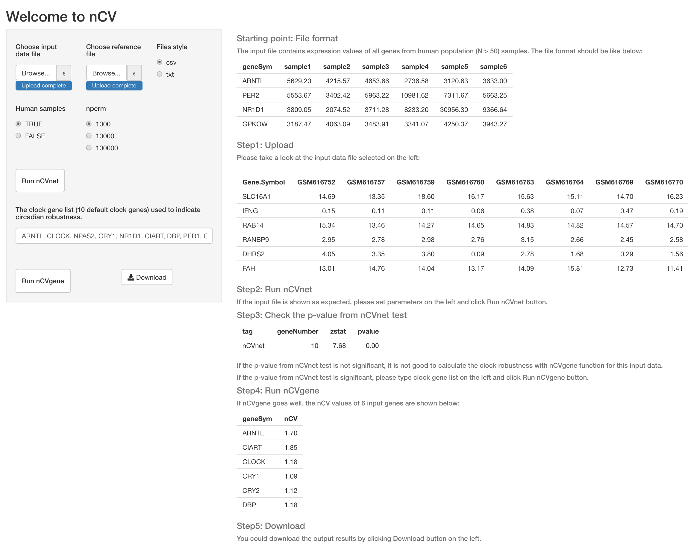

## Introduction about nCVapp

nCVapp is a Shiny app of [nCV](https://github.com/gangwug/nCV) package. 

## License
This package is free and open source software, licensed under GPL(>= 2).
 
## Usage
```r
# install 'shiny' package (if 'shiny' is not installed yet)
install.packages("shiny")
# load 'shiny' package
library(shiny)

# the easy way to run this app 
runGitHub("nCVapp", "gangwug")

# Or you can download all files from this page, and place these files into an directory named 'nCVapp'. 
# Then set 'nCVapp' as your working directory (see more introduction about working directory-http://shiny.rstudio.com/tutorial/quiz/). 
# Now you can launch this app in R with the below commands.
runApp("nCVapp")

```
There is an input data and reference example file ('example_data.csv' and 'example_reference.csv') in this folder. For testing this input data example file, please follow the steps mentioned in this app. If every step goes well, you will see the below picture after clicking 'Run nCVgene'.  




## For more information
Gennady Korotkevich, Vladimir Sukhov, Nikolay Budin, Boris Shpak, Maxim N. Artyomov, Alexey Sergushichev. Fast gene set enrichment analysis. bioRxiv. doi: https://doi.org/10.1101/060012.
